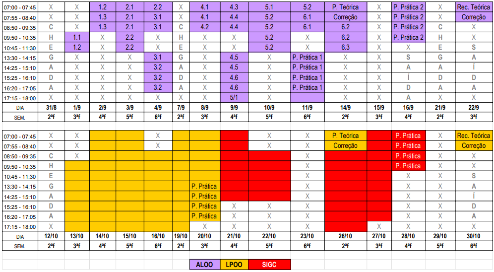

# EAGS SIN 2020 - Algoritmos e Introdução à Programação

A primeira disciplina de 3 que compõem o curso de programação para o EAGS SIN 2020. Aqui você (aluno ou instrutor) conhecerá tudo o que será aprendido ao percorrer das disciplinas.  

## Ementa
* [Unidade 1 - Introdução e Conceitos](#unidade-1)
  * 1.1 - Noções de algoritmos
  * 1.2 - Conceitos de variáveis e funções
  * 1.3 - Operadores
  
* [Unidade 2 - Controle de fluxo e repetição](#unidade-2)
   * 2.1 - Estrutura de desvio de fluxo
   * 2.2 - Estrutura de repetição
   
* [Unidade 3 - Estrturas de dados](#unidade-3)
   * 3.1 - Estruturas lineares
   * 3.2 - Estruturas não lineares
 
* [Unidade 4 - Boas práticas de desenvolvimento](#unidade-4)
   * 4.1 - Análise de algoritmos
   * 4.2 - Princípio da responsabilidade única
   * 4.3 - Refatoração
   * 4.4 - Clean Code
   * 4.5 - Teste em algoritmos
   * 4.5 - Versionamento de código

* [Unidade 5 - Teste em algoritmos](#unidade-5)
   * 5.1 - Cenário de testes
   * 5.2 - Desenvolvimento de testes
   
* [Unidade 6 - Versionamento](#unidade-6) 
  * 6.1 - Cópia de trabalho
  * 6.2 - Publicação de versões e tags
  * 6.3 - Correção de conflítos     

## Ferramentas
Durante nosso curso, diversas ferramentas online serão utilizadas para nos apoiar. 

| Nome da ferramenta | Link |
|:------------------:|------|
| Para executarmos os códigos de exercícios | http://playcode.io/ |
| Organização de projetos | http://www.trello.com |
| Bloco de notas na nuvem | http://dontpad.com/ |
| Perguntas e respostas   | https://kahoot.it/ |
| Sala de aula virtual    | [Convite para ingressar](https://classroom.google.com/c/MTQ3Nzc0NzYxOTMw?cjc=5lrw22h) |

[⬆️ Voltar para o índice](#ementa)

### Cronograma de aula
- Total de 17 aulas para todo o conteúdo.
- Aulas distribuídas em 40 tempos de aula de 45 minutos.

São eles:

*18 tempos* de *aula expositiva*  
*22 tempos* entre *prática orientada* e *prática livre*

A organização das aulas se dará acompanhando os dias disponibilizados na colméia. Veja a seguir:

| Data | Aula          | Título |
|:----:|---------------|--------|
| 01/09/2020 | [Aula 1.1]() | [Noções de algoritmos]()|
| 01 e 02/09/2020 | [Aula 1.2]() | [Conceito de variáveis e funções]()|
| 02/09/2020 | [Aula 1.3]() | [Operadores]()|
| 03/09/2020 | [Aula 2.1]() | [Estruturas de desvio de fluxo]()|
| 03 e 04/09/2020 | [Aula 2.2]() | [Estrutura de repetição]()|
| 04/09/2020 | [Aula 3.1]() | [Estruturas lineares]()|
| 04/09/2020 | [Aula 3.2]() | [Estruturas não lineares]()|
| 08/09/2020 | [Aula 4.1]() | [Análise de algoritmos]()|
| 08/09/2020 | [Aula 4.2]() | [Princípio da responsabilidade única]()|
| 09/09/2020 | [Aula 4.3]() | [Refatoração]()|
| 09/09/2020 | [Aula 4.4]() | [Clean Code]()|
| 09/09/2020 | [Aula 4.5]() | [Teste em algoritmos]()|
| 09/09/2020 | [Aula 4.6]() | [Versionamento de código]()|
| 09 e 10/09/2020 | [Aula 5.1]() | [Cenário de testes]()|
| 10 e 11/09/2020 | [Aula 5.2]() | [Desenvolvimento de testes]()|
| 11/09/2020 | [Aula 6.1]() | [Cópia de trabalho]()|
| 11/09/2020 | [PROVA PRÁTICA 1]() | [Unidades 1,2,3 e 6]()|
| 14/09/2020 | [PROVA TEÓRICA]() | [Unidades 1,2,3 e 4]()|
| 14/09/2020 | [Aula 6.2]() | [Publicação de versões e tags]()|
| 14/09/2020 | [Aula 6.3]() | [Correção de conflítos ]()|
| 16/09/2020 | [PROVA PRÁTICA 2]() | [Unidades 4,5 e 6]()|

[⬆️ Voltar para o índice](#ementa)

## Introdução e Conceitos
### Unidade-1

Nesta unidade o aluno perceberá que todo o mundo da computação teve sua origem no mundo real. O algoritmo que ele já conhece tem um motivo de existir e se iniciou no mundo real, fora do computador. 

O comportamento do mundo real é representado no mundo da computação através de algoritmos. Principalmente hoje em dia, com a ascenção das redes sociais, são os algoritmos que dão vida e inteligencia à internet criando uma verdadeira sociedade de algoritmos que se comporta tal como um humano se comporta. Não, não é exagero pensar dessa forma. O assunto será bastante conversado em sala de aula.

O aluno perceberá que um algoritmo pode ser organizado em funções computacionais com responsabilidades bem definidas para resolverem problemas específicos do mundo real.

Esta unidade tem como propósito aproximar o aluno da representação do comportamento do dia a dia do comportamento computacional através dos algoritmos. 

Com aulas, em sua maior parte expositivas e prática orientada, Introdução e Conceitos permitirá ao aluno seus primeiros passos dessa nova forma de observar algoritmos, longe da abordagem matemática ou científica e mais perto do comportamento humano.

[⬆️ Voltar para o índice](#ementa)

## Controle de fluxo e repetição
### Unidade-2

O mais importante dessa unidade é mostrar como o fluxo de um algoritmo é importante em sua execução. O entendimento será dividido em dois: Desvio de fluxo com o uso de estruturas condicionais e controle de fluxo com estruturas de repetiçao.

Ainda para orientação do aluno, é importante que seja feita uma comparação com o fluxo de atividades do dia a dia com o fluxo de atividades sistemáticas. Os exemplos da apostilas podem ser estrapolados durante a aula criando dinâmicas de grupo para que os alunos assumam o controle de certas atividades do dia a dia tomando notas, na lousa, em papel ou em um bloco de notas no computador, a cada desvio de fluxo ou a cada repetição de instrução. O objetivo dessa dinâmica de grupo é o aluno perceber como o fluxo de um algoritmo se comporta em cada comportamento do algoritmo.

[⬆️ Voltar para o índice](#ementa)

## Estruturas de dados
### Unidade-3

O intuito dessa disciplina é levar ao conhecimento do aluno a definição de dados, tipos, armazenagem e manipulação de dados. O Javascript será linguagem base para essa unidade, porém, apenas será utilizado para as estruturas de dados lineares, que são menos complexas e não exigem um aprofundamento maior na linguagem, pois esse aprofundamento na linguagem não será objeto de nenhuma disciplina desta disciplina.

As estruturas de dados não lineares deverão ser apresentadas no nível de conhecimento da apostila de forma teórica, pois serão melhor praticadas na próxima disciplina com a linguagem de programação Java. 

## Boas práticas de programação
### Unidade-4

[⬆️ Voltar para o índice](#ementa)

Sugere-se que essa unidade seja ministrada dividida em 4 áres de conhecimento:

- Princípio da responsabilidade única: Assunto bastante comentado na apostila e objeto de estudo principal desta disciplina, pois orientará o aluno a compreender que o foco nesse principio o fará utilizar os demais mecanismos descritos nessa disciplina (Refatoraçao, Clean Code e Teste em algoritmos)

- Qualidade de algoritmos: Foco na apresentação das boas práticas de desenvolvimento apresentadas na apostila e em outros conceitos que o instrutor julgar necessário que sejam apresentados. Essa parte do entendimento é focado em orientar o aluno a trabalhar em equipe, escrevendo algoritmos bem escritos para que sejam compreendidos por outros programadores. Sugere-se uma dinâmica de grupo para pair programming ou então para que um grupo entenda o algoritmo que outro grupo escreveu.

- Teste em algoritmos: Nesse momento do conteúdo o foco deverá ser a teoria de requisitos com cenários e testes de comportamento. Prática orientada com criação de testes em papel seguindo o modelo BDD ou aula expositiva com o desenvolvimento de muitos cenários de teste.

- Versionamento de código: Infoque totalmente teórico respeitando o limite de conteúdo exposto na apostila. A prática nessa unidade deverá ocorrer apenas no nível de práticas orientadas.

[⬆️ Voltar para o índice](#ementa)

## Teste em algoritmos
### Unidade-5

Conceito importantíssimo que deverá ser bem praticado em sala de aula, não atoa que haverá uma unidade específica para a prática da identificação de requisitos de software e escrita de teste. É importante que o instrutor, se for utilizar algum framework ou software para a prática desse conteúdo, tenha muita cautela para não se aprofundar em algum conhecimento que fuja do escopo de teste de comportamento BDD e testes de unidade TDD no nível em que é cobrado pela apostila e pelo apoio prático desenvolvido.

[⬆️ Voltar para o índice](#ementa)

## Versionamento de código
### Unidade-6

Prática orientada e livre sobre o assunto discutito no item 4.6 desta disciplina. Suge-se que seja extrapolado em sala de aula o assunto de versionamento com pequenas e grandes equipes em um mesmo projeto. Sugere-se que seja apresentado o conceito de workflow para a compreensão de como o versionamento ajuda na evolução de um projeto ágil de software.

[⬆️ Voltar para o índice](#ementa)
